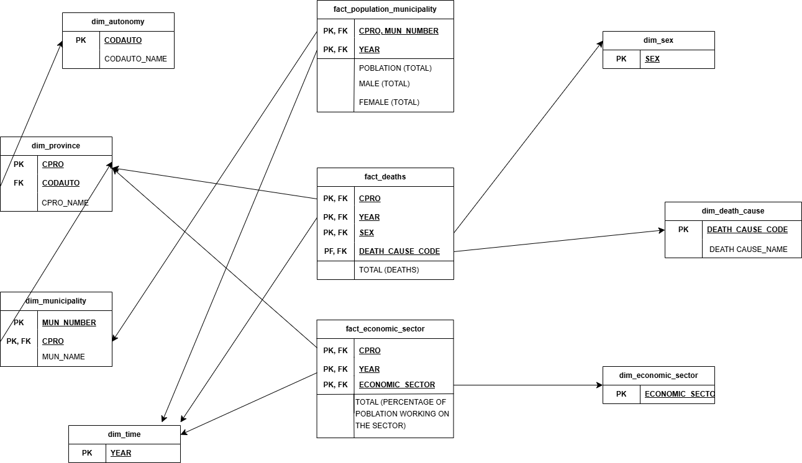
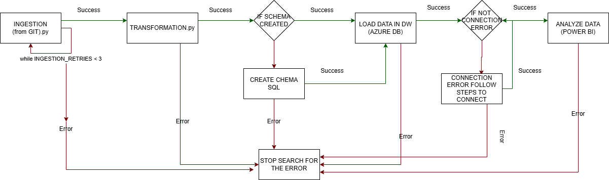

## WAREHOUSE DIMENSIONS AND FACTS

Data Model Justification
The data model has been designed following a star schema approach in order to support efficient analytical queries and historical analysis of demographic, economic, and mortality data at different territorial levels. This structure clearly separates fact tables, which store quantitative measures, from dimension tables, which provide the descriptive context required for analysis.

Territorial dimensions (dim_autonomy, dim_province, and dim_municipality) allow analysis at multiple geographic aggregation levels while preserving the administrative hierarchy. The temporal dimension (dim_time) has been normalized to ensure consistency across time-based analyses and to facilitate year-over-year comparisons. Additional dimensions such as dim_sex, dim_death_cause, and dim_economic_sector enable detailed segmentation of the facts according to key domain variables.

The fact tables (fact_deaths, fact_population_municipality, and fact_economic_sector) use composite primary keys to guarantee record uniqueness and maintain referential integrity with the corresponding dimensions. This design choice accurately reflects the natural granularity of the source data and prevents data duplication.

## PIPELINE (ORCHESTRATION) DIAGRAM 

The pipeline orchestration has been designed to control the execution flow of the data warehouse process, ensuring reliability, data consistency, and clear error handling at each stage. The orchestration coordinates the different pipeline steps while applying distinct execution policies depending on the nature of each task.

The pipeline starts with the ingestion stage, where data is retrieved from external sources. Since this step may fail due to temporary network or availability issues, a retry mechanism is implemented. The ingestion process is retried up to a predefined number of attempts, and only proceeds to the next stage upon successful completion.

Once ingestion succeeds, the pipeline continues with the transformation stage, where data is cleaned, validated, and structured. This step is considered critical for data quality; therefore, any error immediately stops the pipeline, preventing invalid or inconsistent data from propagating downstream.

After transformation, the orchestration verifies whether the database schema exists. If the schema is not present, it is created using SQL scripts before continuing. Any error during schema creation results in a full pipeline stop, as the data warehouse structure is a prerequisite for loading data.

The next stage is the data loading process into the Azure SQL Data Warehouse. This step handles the insertion of both dimensions and facts. Errors at this stage such as connection issues, constraint violations, or duplicate data cause the pipeline to stop and trigger error handling procedures to preserve data integrity.

Finally, if all previous steps complete successfully, the data becomes available for analytical consumption, enabling visualization and analysis in tools such as Power BI. This final stage is only reached when the entire pipeline executes without errors.

