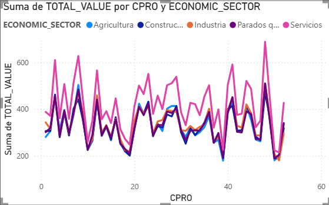

## POWER BI

With all the data gathered, here are some examples of the possibilities to study different scenarios.
More examples could be asked in the presentation.

People died per desease and genre

People working per economic sector 
